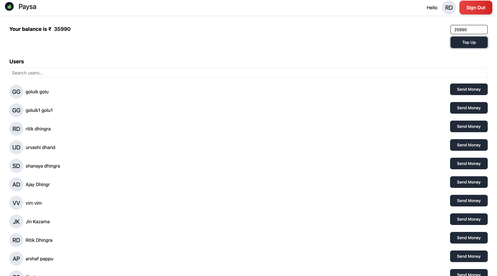

## Paysa Application 

The app supports authentication, balance tracking, and sending money between users.

This repository contains a Paysa wallet application split into two folders:

- `backend/` - Node.js + TypeScript API using Express and Prisma (PostgreSQL)
- `frontend/` - React + TypeScript + Vite single-page app

The README below explains how to run the app locally, how to configure environment variables.

---

## Project structure

- `backend/` - Express API, Prisma client generated to `backend/src/generated/prisma`.
	- `src/` - TypeScript source files
	- `prisma/` - Prisma schema and migrations
	- `.env` - runtime environment variables (see `backend/.env.example`)

- `frontend/` - Vite + React app
	- `src/` - React components and pages
	- `public/` or `frontend/assets/` - place static assets or screenshots here

---


## Dashboard preview

Below is a screenshot of the **Dashboard page** showing wallet balance and users list.




---

## Environment variables

Use the `backend/.env.example` as a template and create a `backend/.env` locally.

---

## Backend: quick start

Prerequisites: Node >= 18, npm, and a PostgreSQL-compatible database (Neon, Postgres, etc.).

1. Install dependencies

```bash
cd backend
npm install
```

2. Create `.env` (copy `.env.example` and fill values):

```bash
cp .env.example .env
# edit .env and set DATABASE_URL and SECRET_KEY
```

3. Generate Prisma client and apply migrations (development):

```bash
npx prisma migrate dev
npx prisma generate
```

4. Build and run the backend

```bash
npx tsc
npm run dev
```

The API will listen on port `3000` by default.

---

## Frontend: quick start

Prerequisites: Node >= 18, npm

1. Install dependencies

```bash
cd frontend
npm install
```

2. Run dev server

```bash
npm run dev
```

Open the app in your browser (Vite will print the local URL, usually `http://localhost:5173`).

---

## How authentication works (short)

- The backend issues a JWT on sign-in/sign-up.
- The frontend stores the token in `localStorage` and sends it in the `token` header for protected API calls.
- Protected routes in the frontend redirect unauthenticated or expired sessions to `/signin`.

---

Readme generated with the help of copilot
